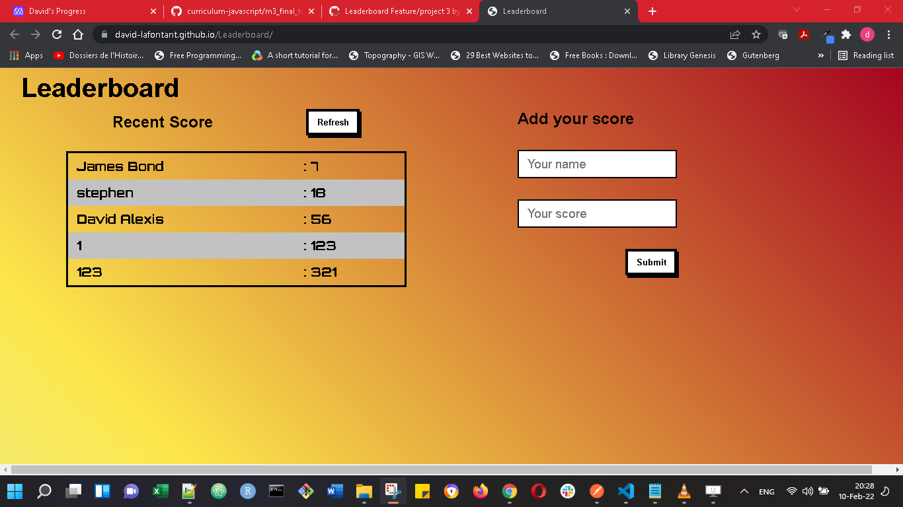

# Leaderboard project 1

## Live demo link

[Live demo Link](https://david-lafontant.github.io/Leaderboard/)

## Screenshot

## Description
This is a basic website; a Leader board Application that displays a list that looks and behaves like the part of minimalist project.

## Getting started

To explore or play with this code you should :

- Download and install Git
- Clone the repository with: `git clone https://github.com/david-lafontant/Leaderboard.git`
- Open the repository with: `cd Leaderboard` 
- Use your favorite Integrated Development Environment (e.g. for Visual Studio Code the command is `code .`)
- Install webpack with: `npm install --save-dev webpack webpack-cli`
- Type in `nmp run start` or run live server from the docs directory

## How it works

The Leaderboard web application allows the user to enter the name and the score of a leader.
* By clicking on the submit button the information regarding the leader is stored in memory;
* By clicking on the refresh button the list of leader in memory and their score are displayed on the screen;

## Technologies Used
* CSS
* HTML
* JAVASCRIPT
* GitHub

## Author

#### 👤 Author
- GitHub: [@david-lafontant](https://github.com/david-lafontant)
- Twitter: [@manikatex](https://twitter.com/manikatex)

## Contributing 
Contributions, issues, and feature requests are welcome!

## Show your support
Please give a ⭐️ if you like this project! 

## Acknowledgments
- Hat tip to anyone contributed one way or the other.
- Inspiration
- etc

## License
This project is [MIT](https://github.com/microverseinc/readme-template/blob/master/MIT.md) licensed.